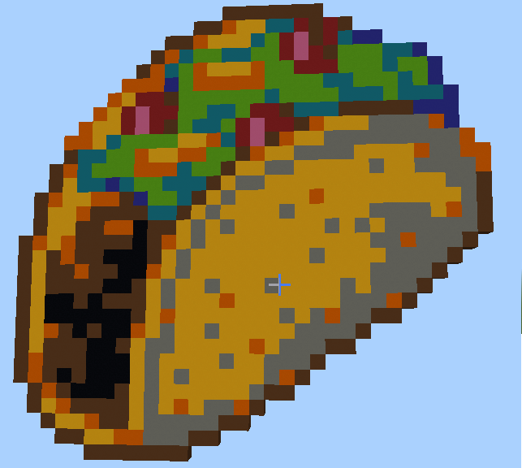
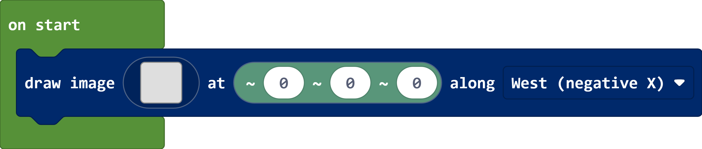
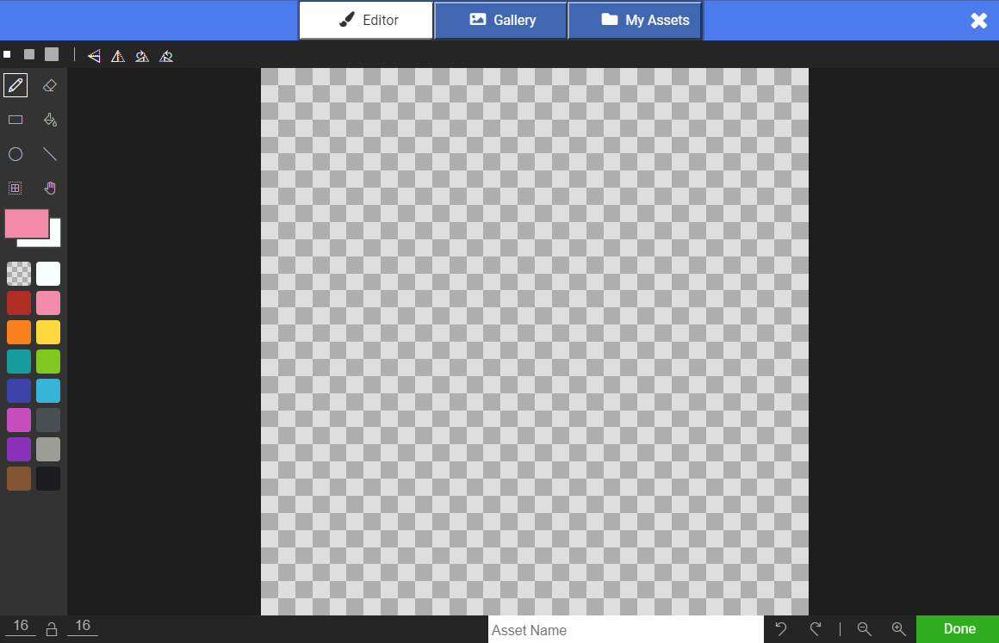

# makecode-minecraft-pixel-art

An extension for Microsoft MakeCode that lets you take pixel art and build it in Minecraft Education using concrete blocks. For example, here's a taco:

You can create your art using the MakeCode pixel art editor. To get started, click on the empty square on the image block to launch the editor!

## Keyboard shortcuts

For a full list of keyboard shortcuts supported by the pixel art editor, see the [documentation here](https://makecode.com/asset-editor-shortcuts).

## MakeCode Arcade

This pixel art editor is compatible with the sprites from [MakeCode Arcade](https://arcade.makecode.com). You can use ctrl-C and ctrl-V to copy and paste sprites between the two editors!

## Contributing

This project welcomes contributions and suggestions.  Most contributions require you to agree to a
Contributor License Agreement (CLA) declaring that you have the right to, and actually do, grant us
the rights to use your contribution. For details, visit https://cla.opensource.microsoft.com.

When you submit a pull request, a CLA bot will automatically determine whether you need to provide
a CLA and decorate the PR appropriately (e.g., status check, comment). Simply follow the instructions
provided by the bot. You will only need to do this once across all repos using our CLA.

This project has adopted the [Microsoft Open Source Code of Conduct](https://opensource.microsoft.com/codeofconduct/).
For more information see the [Code of Conduct FAQ](https://opensource.microsoft.com/codeofconduct/faq/) or
contact [opencode@microsoft.com](mailto:opencode@microsoft.com) with any additional questions or comments.

## Trademarks

This project may contain trademarks or logos for projects, products, or services. Authorized use of Microsoft 
trademarks or logos is subject to and must follow 
[Microsoft's Trademark & Brand Guidelines](https://www.microsoft.com/en-us/legal/intellectualproperty/trademarks/usage/general).
Use of Microsoft trademarks or logos in modified versions of this project must not cause confusion or imply Microsoft sponsorship.
Any use of third-party trademarks or logos are subject to those third-party's policies.
